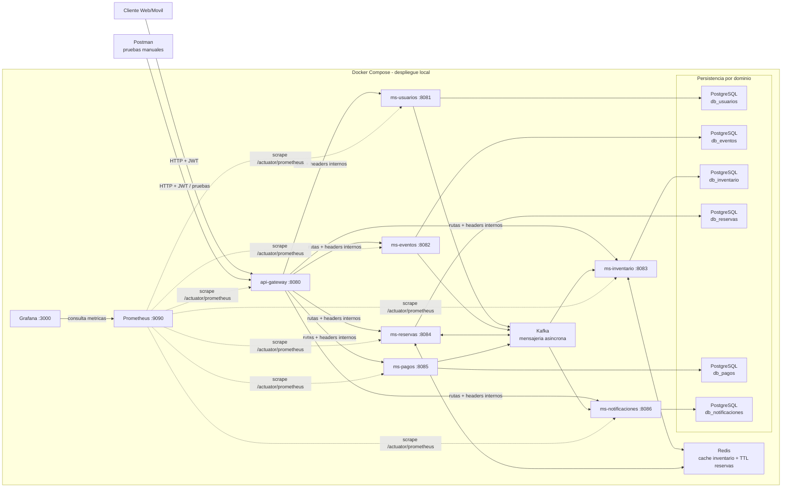

# 5. Diagrama de arquitectura

La solución centraliza la entrada en `api-gateway`, que valida JWT e inyecta headers internos antes de enrutar a los microservicios. Cada dominio persiste en su propia base PostgreSQL, mientras Redis acelera disponibilidad y conserva TTL de reservas.

Kafka desacopla los flujos de eventos entre servicios y Prometheus obtiene métricas de los siete servicios para que Grafana construya dashboards operativos. Todo el entorno local se orquesta desde Docker Compose.
