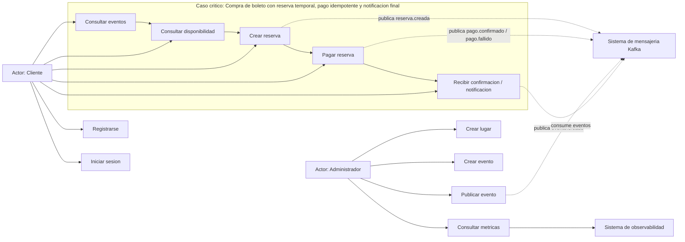

# 6. Diagrama de casos de uso

| Actor | Caso de uso | Microservicio responsable | Descripcion breve |
|---|---|---|---|
| Cliente | Registrarse | `ms-usuarios` | Crea una cuenta para usar la plataforma. |
| Cliente | Iniciar sesion | `ms-usuarios` | Obtiene JWT para operar a traves del gateway. |
| Cliente | Consultar eventos | `ms-eventos` | Lista eventos activos disponibles para compra. |
| Cliente | Consultar disponibilidad | `ms-inventario` | Consulta cupos por seccion con soporte de cache Redis. |
| Cliente | Crear reserva | `ms-reservas` + `ms-inventario` | Inicia la saga y reserva inventario temporalmente. |
| Cliente | Pagar reserva | `ms-pagos` | Procesa pago idempotente y genera eventos de resultado. |
| Cliente | Recibir notificacion | `ms-notificaciones` | Registra confirmacion, expiracion o fallo. |
| Administrador | Crear lugar | `ms-eventos` | Registra el recinto del evento. |
| Administrador | Crear evento | `ms-eventos` | Crea el evento en estado inicial. |
| Administrador | Publicar evento | `ms-eventos` | Activa el evento y publica `evento.creado`. |
| Administrador | Consultar metricas | Prometheus + Grafana | Revisa salud y metricas de los servicios. |
| Kafka | Coordinar eventos de dominio | Varios servicios | Transporta eventos asincronos entre dominios. |
| Sistema de observabilidad | Recolectar metricas | Prometheus | Scrapea Actuator de los siete servicios. |
