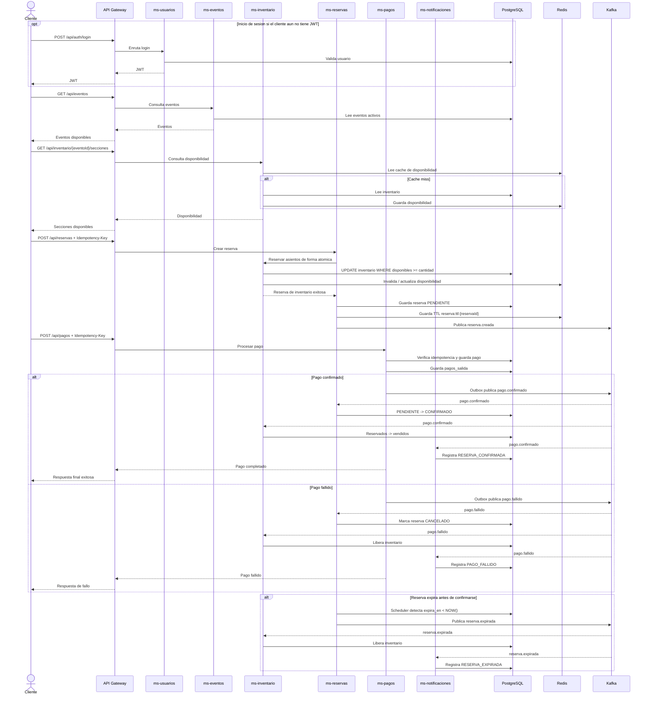

# 7. Diagrama de secuencia del caso critico

La compra de boleto es el caso critico porque combina consistencia de inventario, idempotencia de pago, expiracion temporal y coordinacion asincrona. El flujo principal confirma la reserva y vende los asientos; las ramas alternativas compensan un fallo de pago o una expiracion sin dejar inventario bloqueado.
