# 8. Diagrama de componentes

```mermaid
flowchart TB
    subgraph gateway["api-gateway"]
        rutas["GatewayConfig\nrutas"]
        filtro["JwtAuthFilter\nvalidacion JWT"]
        jwtgw["JwtUtil"]
        headers["Inyeccion X-Usuario-*"]
        rutas --> filtro --> jwtgw
        filtro --> headers
    end

    subgraph usuarios["ms-usuarios - REST + producer"]
        authCtrl["AuthController"]
        authSvc["AuthService"]
        usrRepo["UsuarioRepository"]
        jwtUsr["JwtUtil / JwtConfig"]
        usrProd["UsuarioProducer\nusuario.registrado"]
        authCtrl --> authSvc
        authSvc --> usrRepo
        authSvc --> jwtUsr
        authSvc --> usrProd
    end

    subgraph eventos["ms-eventos - REST + producer"]
        eventoCtrl["EventoController\nincluye lugares y eventos"]
        eventoSvc["EventoService"]
        eventoRepos["EventoRepository\nLugarRepository"]
        eventoProd["EventoProducer\nevento.creado"]
        eventoCtrl --> eventoSvc
        eventoSvc --> eventoRepos
        eventoSvc --> eventoProd
    end

    subgraph inventario["ms-inventario - REST + consumer"]
        invCtrl["InventarioController"]
        invSvc["InventarioService"]
        cacheSvc["InventarioCacheService"]
        invRepos["InventarioSeccionRepository\nSeccionRepository\nMesaRepository\nAsientoRepository"]
        invConsumer["InventarioConsumer"]
        invCtrl --> invSvc
        invSvc --> cacheSvc
        invSvc --> invRepos
        invConsumer --> invRepos
    end

    subgraph reservas["ms-reservas - REST + producers + consumers"]
        reservaCtrl["ReservaController"]
        reservaSvc["ReservaService"]
        sagaSvc["ReservaSagaService"]
        reservaRepos["ReservaRepository\nDetalleReservaRepository"]
        ttl["Redis TTL"]
        scheduler["ReservaExpirationScheduler"]
        reservaProd["ReservaProducer"]
        reservaConsumer["ReservaConsumer"]
        reservaCtrl --> reservaSvc
        reservaSvc --> sagaSvc
        reservaSvc --> reservaRepos
        sagaSvc --> ttl
        scheduler --> reservaProd
        reservaSvc --> reservaProd
        reservaConsumer --> reservaRepos
    end

    subgraph pagos["ms-pagos - REST + outbox + producer"]
        pagoCtrl["PagoController"]
        pagoSvc["PagoService"]
        pagoRepo["PagoRepository"]
        salidaRepo["PagosSalidaRepository"]
        pagoProd["PagoProducer\noutbox scheduler + Kafka producer"]
        pagoCtrl --> pagoSvc
        pagoSvc --> pagoRepo
        pagoSvc --> salidaRepo
        pagoProd --> salidaRepo
    end

    subgraph notificaciones["ms-notificaciones - REST + consumers"]
        notifCtrl["NotificacionController"]
        notifSvc["NotificacionService"]
        notifRepo["NotificacionRepository"]
        notifConsumer["NotificacionConsumer\ndeduplicacion"]
        notifCtrl --> notifSvc
        notifSvc --> notifRepo
        notifConsumer --> notifSvc
    end

    postgres["PostgreSQL"]
    redis["Redis"]
    kafka["Kafka"]
    prometheus["Prometheus"]
    grafana["Grafana"]
    compose["Docker Compose"]

    authSvc --> postgres
    eventoSvc --> postgres
    invRepos --> postgres
    reservaRepos --> postgres
    pagoRepo --> postgres
    salidaRepo --> postgres
    notifRepo --> postgres

    cacheSvc --> redis
    ttl --> redis

    usrProd --> kafka
    eventoProd --> kafka
    reservaProd --> kafka
    pagoProd --> kafka
    kafka --> invConsumer
    kafka --> reservaConsumer
    kafka --> notifConsumer

    prometheus -.-> gateway
    prometheus -.-> usuarios
    prometheus -.-> eventos
    prometheus -.-> inventario
    prometheus -.-> reservas
    prometheus -.-> pagos
    prometheus -.-> notificaciones
    grafana --> prometheus

    compose -.-> gateway
    compose -.-> usuarios
    compose -.-> eventos
    compose -.-> inventario
    compose -.-> reservas
    compose -.-> pagos
    compose -.-> notificaciones
    compose -.-> postgres
    compose -.-> redis
    compose -.-> kafka
    compose -.-> prometheus
    compose -.-> grafana
```

| Componente | Tipo | Responsabilidad | Dependencias |
|---|---|---|---|
| `api-gateway` | Infraestructura REST | Rutas, JWT e inyeccion de headers internos | `ms-*`, JWT |
| `AuthController` / `AuthService` | Aplicacion | Registro, login y perfil | PostgreSQL, `JwtUtil`, `UsuarioProducer` |
| `EventoController` / `EventoService` | Aplicacion | Lugares, eventos y publicacion | PostgreSQL, Kafka |
| `InventarioController` / `InventarioService` | Aplicacion | Disponibilidad, reserva atomica y liberacion | PostgreSQL, Redis |
| `InventarioConsumer` | Mensajeria | Consume eventos para inventario | Kafka, PostgreSQL |
| `ReservaController` / `ReservaService` | Aplicacion | Gestion de reservas | PostgreSQL, saga, Kafka |
| `ReservaSagaService` | Dominio | Coordina reserva de inventario y TTL | Redis, `ms-inventario` |
| `ReservaExpirationScheduler` | Scheduler | Expira reservas pendientes | PostgreSQL, Kafka |
| `PagoController` / `PagoService` | Aplicacion | Pago idempotente y escritura de outbox | PostgreSQL |
| `PagoProducer` | Producer + scheduler | Publica outbox a Kafka | `PagosSalidaRepository`, Kafka |
| `NotificacionController` / `NotificacionService` | Aplicacion | Consulta y registro de notificaciones | PostgreSQL |
| `NotificacionConsumer` | Mensajeria | Consume eventos y deduplica | Kafka, PostgreSQL |
| PostgreSQL | Datos | Persistencia por dominio | Servicios de dominio |
| Redis | Datos en memoria | Cache y TTL | `ms-inventario`, `ms-reservas` |
| Kafka | Mensajeria | Eventos asincronos | Producers y consumers |
| Prometheus | Observabilidad | Scrape de metricas | Actuator |
| Grafana | Observabilidad | Dashboards | Prometheus |
| Docker Compose | Despliegue local | Orquesta servicios e infraestructura | Todos los contenedores |
